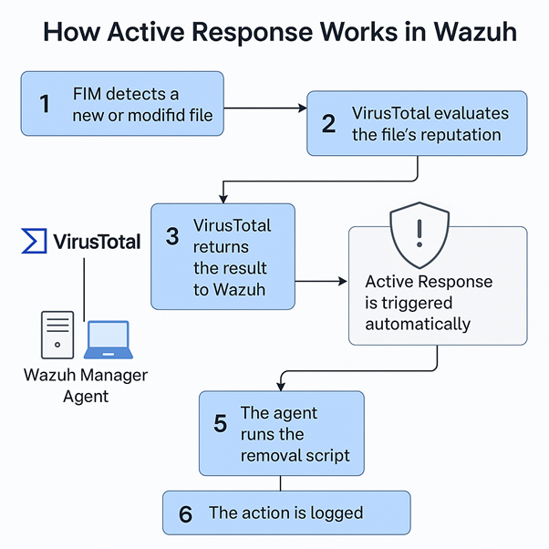
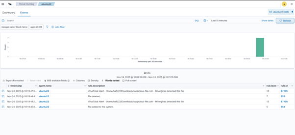

# 🛡 Wazuh FIM + Active Response

Automate malware deletion by combining File Integrity Monitoring, VirusTotal integration, and Wazuh Active Response — detect, confirm, and remove threats automatically.

[Wazuh Home](https://wazuh.com/?utm_source=ambassadors&utm_medium=referral&utm_campaign=ambassadors%20program) ·
[Wazuh Ambassador Program](https://wazuh.com/ambassadors-program/?utm_source=ambassadors&utm_medium=referral&utm_campaign=ambassadors+program) ·
[Portfolio](https://hafizkh.dev/)

---

## 📑 Table of Contents
1. [Introduction](#1-introduction)
2. [Benefits of Using Active Response with VirusTotal](#2-benefits-of-using-active-response-with-virustotal)
3. [How Active Response Works in Wazuh](#3-how-active-response-works-in-wazuh)
4. [How to Configure Automatic Malware Deletion](#4-how-to-configure-automatic-malware-deletion)
5. [Testing the Automatic Removal (Using EICAR)](#5-testing-the-automatic-removal-using-eicar)
6. [Active Response Results in Wazuh Dashboard (Linux Agent)](#6-active-response-results-in-wazuh-dashboard-linux-agent)
7. [Windows Support (Windows Agent)](#7-windows-support-windows-agent)
8. [Conclusion](#8-conclusion)

---

## 1. Introduction

In the previous tutorial, we used File Integrity Monitoring (FIM) with VirusTotal to identify whether a newly created or modified file is safe or malicious. While this feature provides strong visibility, detection alone is not enough — malicious files can still be executed or spread before an analyst reacts.

To enhance protection, Wazuh allows us to use **Active Response**. With this feature, the system can automatically act when VirusTotal reports that a file is harmful. In this tutorial, we configure Wazuh to automatically **delete any malicious file** detected by FIM and confirmed by VirusTotal. This turns Wazuh from a monitoring tool into an automated threat-response system, improving security and response.

---

## 2. Benefits of Using Active Response with VirusTotal

Using Active Response along with VirusTotal adds an extra layer of automated protection to the environment. The key benefits include:

- Malicious files detected by VirusTotal are immediately deleted without waiting for manual investigation.
- The system reacts within seconds, reducing the risk of malware execution or lateral movement.
- Routine malware cleanup is handled automatically, so that analysts may focus on more important tasks.
- Active Response ensures that known malicious files are eliminated before they can cause any impact.

---

## 3. How Active Response Works in Wazuh

The workflow for this active response is straightforward:

1. **FIM detects** a new/modified file.
2. Wazuh sends the file hash to **VirusTotal**.
3. If VirusTotal finds malware → **Rule ID 87105** triggers.
4. Active Response listens for this rule.
5. When triggered, it executes your script (delete or quarantine the file).
6. The action is logged.

> Learn more about response automation here: [Wazuh Active Response](https://documentation.wazuh.com/current/user-manual/capabilities/active-response/index.html)


*Figure 1: Active Response workflow*

This automation ensures a clean, efficient workflow that enhances security.

---

## 4. How to Configure Automatic Malware Deletion

The setup requires three main components:

1. **FIM** monitoring of a directory
2. **VirusTotal** integration on the Wazuh Manager
3. **An Active Response script** that removes the malicious file (`remove-threat.sh`)

### 4.1 Enable FIM Monitoring on the Agent

On the Wazuh agent, edit the agent configuration file (`/var/ossec/etc/ossec.conf`) inside the `<syscheck>` block to monitor downloaded files:

```xml
<directories realtime="yes">/home/<your-username>/Downloads</directories>
```

**Code Snippet 1: Directories to be checked by FIM**

Save the file and restart the agent:

```bash
sudo systemctl restart wazuh-agent
```

**Code Snippet 2: Restarting agent command**

### 4.2 Enable VirusTotal Integration & Register Script on the Manager

Add the following section inside the `<ossec_config>` block in the Wazuh Manager configuration:

```xml
<integration>
  <name>virustotal</name>
  <api_key>YOUR_VIRUSTOTAL_API_KEY</api_key>
  <group>syscheck</group>
  <alert_format>json</alert_format>
</integration>

<command>
  <name>remove-threat</name>
  <executable>remove-threat.sh</executable>
  <timeout_allowed>no</timeout_allowed>
</command>

<active-response>
  <disabled>no</disabled>
  <command>remove-threat</command>
  <location>local</location>
  <rules_id>87105</rules_id>
</active-response>
```

**Code Snippet 3: VirusTotal API Key block and registering the script**

> Full documentation reference: [VirusTotal integration](https://documentation.wazuh.com/current/user-manual/capabilities/malware-detection/virus-total-integration.html)

### 4.3 Create the Malware Removal Script on the Agent

On the agent machine, create the Active Response script:

```bash
sudo nano /var/ossec/active-response/bin/remove-threat.sh
```

**Code Snippet 4: Creating the malware removal file**

The script for this malware removal file is:

```bash
#!/bin/bash

# Go to Wazuh base directory
LOCAL_DIR="$(dirname "$0")"
cd "$LOCAL_DIR/../" || exit 1
BASE_DIR="$(pwd)"

LOG_FILE="${BASE_DIR}/../logs/active-responses.log"

# Read JSON input from Wazuh (one line)
read INPUT_JSON

# Extract file path and command from JSON
FILENAME=$(echo "$INPUT_JSON" | jq -r '.parameters.alert.data.virustotal.source.file')
COMMAND=$(echo "$INPUT_JSON" | jq -r '.command')

# Only act for "add" (when AR is triggered)
if [ "$COMMAND" = "add" ]; then
  # Ask wazuh-execd if we can continue (standard AR handshake)
  printf '{"version":1,"origin":{"name":"remove-threat","module":"active-response"},"command":"check_keys","parameters":{"keys":[]}}\n'

  read RESPONSE
  DECISION=$(echo "$RESPONSE" | jq -r '.command')

  if [ "$DECISION" != "continue" ]; then
    echo "$(date '+%Y/%m/%d %H:%M:%S') remove-threat.sh: Aborted by execd: $INPUT_JSON" >> "$LOG_FILE"
    exit 0
  fi
fi
```

**Code Snippet 5: Script for malware removal**

Make the script executable:

```bash
sudo chmod 750 /var/ossec/active-response/bin/remove-threat.sh
sudo chown root:wazuh /var/ossec/active-response/bin/remove-threat.sh
```

**Code Snippet 6: Script to be executable**

Restart the manager:

```bash
sudo systemctl restart wazuh-manager
```

**Code Snippet 7: Restarting the Wazuh Manager**

Restart the Wazuh Agent:

```bash
sudo systemctl restart wazuh-agent
```

**Code Snippet 8: Restarting the Wazuh agent**

> Advanced users can build more response scripts using: [Custom active response scripts](https://documentation.wazuh.com/current/user-manual/capabilities/active-response/custom-active-response-scripts.html)

---

## 5. Testing the Automatic Removal (Using EICAR)

For testing, we use a file from **EICAR**, which is a trusted organization providing test samples for antivirus software. The EICAR test file is safe and used worldwide for security testing. Download it on the Wazuh agent:

```bash
curl -Lo ~/Downloads/suspicious-file.com https://secure.eicar.org/eicar.com
```

**Code Snippet 9: EICAR source file**

This file is designed to mimic malware behavior, so VirusTotal will mark it as suspicious immediately.

---

## 6. Active Response Results in Wazuh Dashboard (Linux Agent)

Once the integration is enabled, Wazuh automatically sends file hashes to VirusTotal whenever FIM detects a new or modified file. The results can be viewed directly in the Wazuh Dashboard.

To check the VirusTotal alerts:

1. Open the **Wazuh Dashboard** → Go to **Threat Hunting**
2. In the search bar, type `virustotal`
3. You will see all events generated by the VirusTotal integration, including the file path, detection results, and the number of antivirus engines that flagged the file


*Figure 2: Wazuh Dashboard response in Threat Hunting*

> Learn how to analyze threats using the Threat Hunting module: [Threat hunting](https://documentation.wazuh.com/current/user-manual/capabilities/threat-hunting/index.html)

---

## 7. Windows Support (Windows Agent)

The workflow described in this tutorial is not limited to Linux. Wazuh **File Integrity Monitoring (FIM)**, **VirusTotal integration**, and **Active Response** can also be used to protect **Windows endpoints**.

By monitoring directories such as:

```
C:\Users\*\Downloads
C:\Users\*\Documents
C:\Users\*\Desktop
```

**Code Snippet 10: Directories to be monitored**

Wazuh detects new or modified files and sends their hashes to VirusTotal. If VirusTotal identifies the file as malicious, Active Response can automatically trigger a custom script (compiled as `remove-threat.exe`) that deletes the threat before it has a chance to execute.

> For a complete Windows walkthrough including FIM configuration, VirusTotal checks, and generating an executable removal script, please follow the official guide:
> [Ransomware protection on Windows with Wazuh](https://documentation.wazuh.com/current/proof-of-concept-guide/detect-remove-malware-virustotal.html)

---

## 8. Conclusion

With this setup:

- **FIM** detects new or modified files
- **VirusTotal** checks the file's reputation
- **Active Response** automatically deletes or quarantines malware
- All events appear immediately in the **Wazuh Dashboard**

This workflow transforms Wazuh from passive monitoring into **real-time automated protection**, reducing response time and improving overall system security.

---

## 📥 Download the Full Tutorial (PDF)

[👉 Download PDF](./FIM%20with%20ActiveResponse.pdf)

---

## 🛰 Follow the Wazuh Weekly Tutorials

This guide is part of the **Wazuh Weekly Tutorials** series to help you implement and understand real security use cases.

---

## 👤 Connect with Me

- [LinkedIn – Hafiz Javid](https://www.linkedin.com/in/hafiz-javid/)
- [Portfolio – hafizkh.dev](https://hafizkh.dev/)
